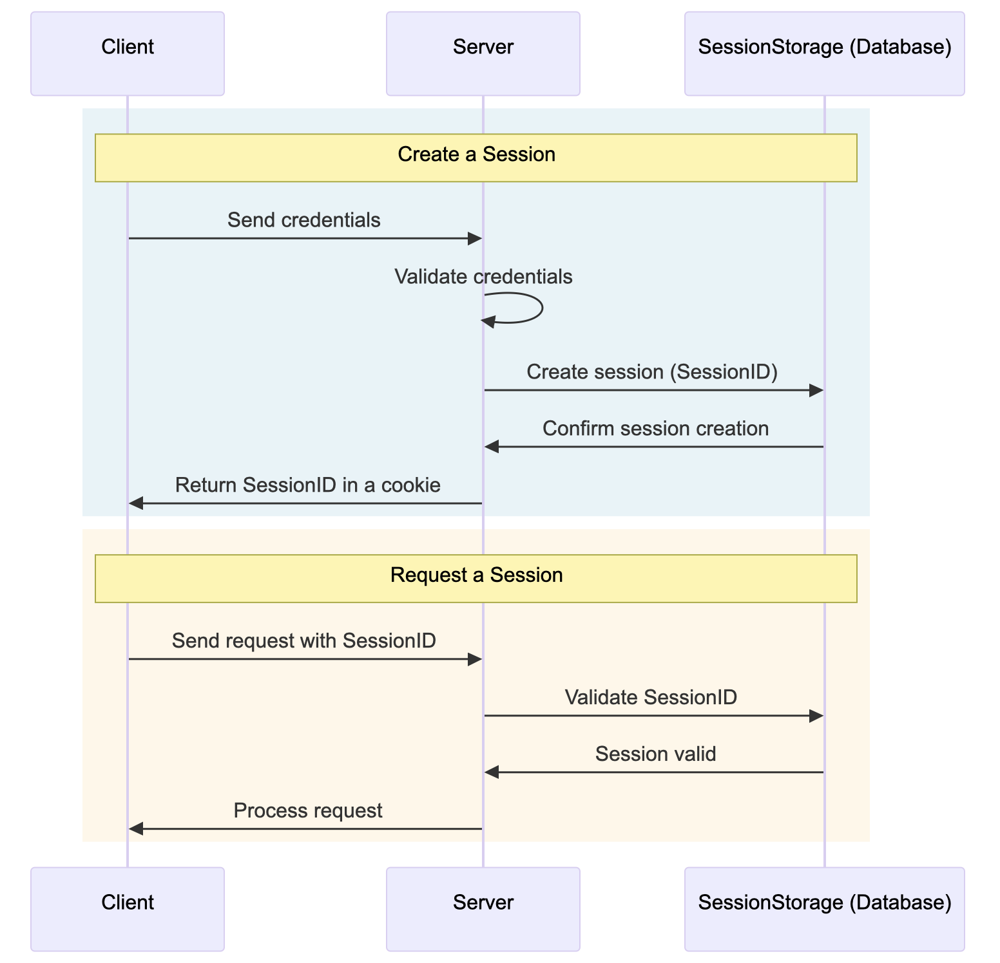

# Forum

Forum is the pet project about making forum website with help CRUD operations
working with db sqlite3, auth, and etc.

## How execute project ?

` go run ./cmd/api/main.go `

- if you have problems with CGO, you can use ...

` go run ./cmd/run-dev/main.go `

- This `main.go` pull all need packages and run project.

## Useful SQLite3 commands

```
    sqlite3 data/forum.db       | for open main database
    
    // next commands use in sqlite3

    .tables                      | show all tables
    .shema [some table]          | show table structure
    .exit                        | exit from sqlite3
```

## Authentication

Auth in the forum based on sessions



## bla bla bla